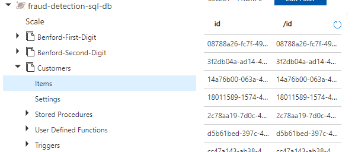

# Configure Cosmos DB

In this Section you will configure the Azure Cosmos DB service. We will use the SQL API and the Gremlin API from Cosmos DB. For more informations about Cosmos DB, please check the [Cosmos DB Documentation](https://azure.microsoft.com/en-us/services/cosmos-db/).

## Prerequisites

You should have the following Service configured:

- Azure Cosmos DB - [SQL API](https://docs.microsoft.com/en-us/azure/cosmos-db/choose-api#coresql-api)

The service is deployed using the **Deploy to Azure** button ([see the main Section](./README.md)).

To run the scripts to feed the Containers with Sample Data you will need [Azure Cosmos DB Python SDK](https://docs.microsoft.com/en-us/azure/cosmos-db/sql/sql-api-sdk-python). If you want, you can create a Python's environment to install de package below:

```python
pip install --pre azure-cosmos
```

## Concepts

You can use our sample data to test the Architecture. Three Cosmos DB containers should be loaded in our Cosmos DB SQL API. Let's see the purpose of each one:

- Benford-First-Digit and Benford-Second-Digit: We will use some of the [Benfors's Law](https://en.wikipedia.org/wiki/Benford's_law) concepts in this architecture and to represent these concepts we should have two DBs to persist the digits distributions. **Benford-First-Digit** container will have nine documents each one representing a single digit from 1 to 9. **Benford-Second-Digit** container will have ten documents, one more than First Digit because we can have zero in the second position. For each transaction the input digits in *amount* field will sensibilize these two containers. For example, let's suppose our system received only nine transactions, all with the same value $ 100. Our first digit distribution will be 100\% of value 1, and 100\% of value 0 for the second digit. In this same case, if we have another transaction with the value *$ 210*, totalizing ten transactions received, our new distribution will be: 90\% of value 1 and 10\% of value 2 for first digit. And 90\% of value 0 and 10\% of value 1 for second digit. The Benford's Law describe a pattern where the digits should follow a certain distribution so we can use these data to check if there is a anomaly behavior. For more details please check the [Benfors's Law](https://en.wikipedia.org/wiki/Benford's_law).

- Customers: This container will have sample data simulating Customer's data. We use these data to enrich some later processes with Customer's information (eg. name, location, etc.). We provide sample data only to demonstrate the architecture, however you can use your own Customer's data if you want.

## Quick Start

First of all, let's add the sample data. 

You need to put your CosmosDB SQL API settings in the config.py file. We provide an [example](./Scripts/config.py.example). Please rename it to config.py and fill with your Cosmos DB Endpoint and Key. After, run the command below in your shell:

```python 
python feed_sample_data.py
````

After running this process check if the three containers were loaded:



With these containers loaded we can proceed to the next step. Deploy the Functions 😎.