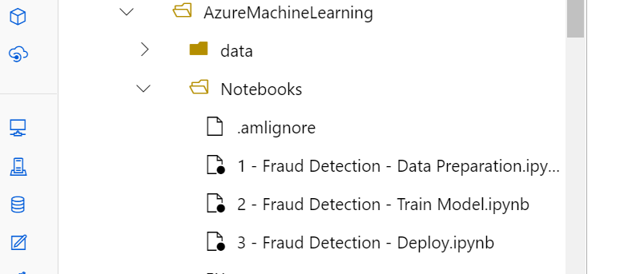
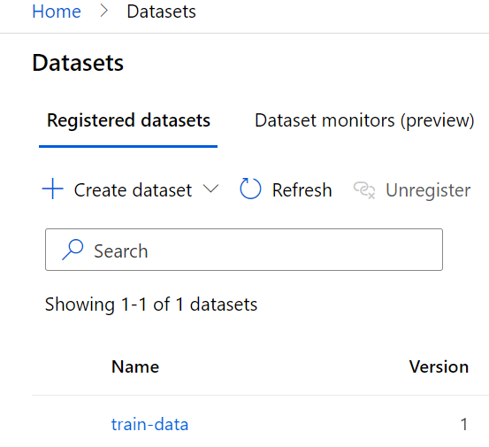
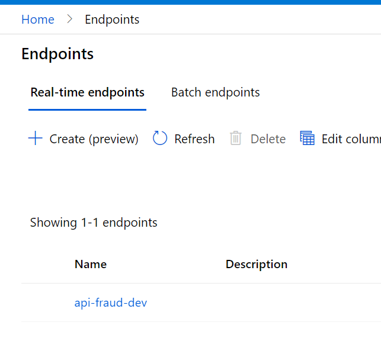
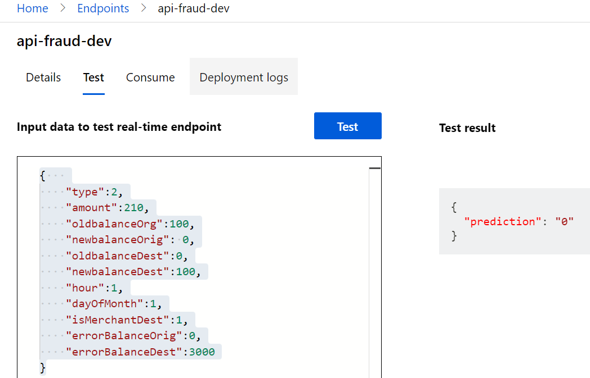

# Configure Azure ML Environment

In this Section you will configure the Azure ML Environment. Please be sure you have an Azure ML Workspace with a Computer Instance and a Computer Cluster created. For more informations about that, please check the [Azure ML documentation](https://docs.microsoft.com/en-us/azure/machine-learning/quickstart-create-resources).

## Prerequisites

This repo uses a [Git LFS](https://git-lfs.github.com/) feature to lead with Large Files. Please install Git Lfs in the terminal of your AML Compute Instance running the following codes:

- Add git-lfs package and install

`curl -s https://packagecloud.io/install/repositories/github/git-lfs/script.deb.sh | sudo bash`

`sudo apt-get install git-lfs`

`git lfs install`


## Quick Start

With an Azure ML Compute Instance we can clone the repo and start to execute the notebooks. For this, open the terminal in your Computer Instance and use the commands below:

- Clone the repo: `git clone https://github.com/microsoft/azure-realtime-fraud-detection.git`
- Check the [Notebooks folder](./Notebooks/). You should see these notebooks:



- Unzip the Dataset: Go to the folder ./AzureMachineLearning/data and run `unzip archive.zip`. This action will unzip the Dataset to be used in the model training.

Now with the notebooks, you can follow the Steps below to Train and Deploy the Fraud Classification Model.

## Fraud Detection Model

In this step, we will train a Machine Learning model that performs the classification of whether or not an incoming transaction is a possible Fraud. For this, a very simple model will be trained using the [Random Forest](https://en.wikipedia.org/wiki/Random_forest) algorithm. To implement it, we will use the framework [SKLearn](https://scikit-learn.org/stable/index.html) widely used for model development.

This model uses synthetic financial transaction data. The Dataset was collected from [Kaggle](https://www.kaggle.com/ealaxi/paysim1).

This is just an example for demonstrations purposes. Feel free to use your own Dataset as well as develop and adapt your own Machine Learning Models.

### Prepare the Data

> Before training the model we need to prepare the data. Please use this [Data Preparation - Notebook](./Notebooks/1%20-%20Fraud%20Detection%20-%20Data%20Preparation.ipynb). 

After running this Notebook you will be able to use a prepared Dataset registered in your Workspace:



### Train the Model

Now we can run the [Train Model - Notebook](Notebooks/2%20-%20Fraud%20Detection%20-%20Train%20Model.ipynb)

In the end, we will have a trained model and we deploy it.

### Deploy

With the trained model, now we will deploy it to an AKS inference cluster.

Just follow the [Deploy - Notebook](Notebooks/3%20-%20Fraud%20Detection%20-%20Deploy.ipynb).

The first deployment takes around 10 min. After the conclusion you should see the endpoint on AML Workspace:



You can make a test request directly in the Endpoints' interface. Use can this payload: 

```python
{   
    "type":2,
    "amount":210,
    "oldbalanceOrg":100,
    "newbalanceOrig": 0,
    "oldbalanceDest":0,
    "newbalanceDest":100,
    "hour":1,
    "dayOfMonth":1,
    "isMerchantDest":1,
    "errorBalanceOrig":0,
    "errorBalanceDest":3000
}
```



Yes we have the prediction 😎 

The prediction equal to `0` means that for this request it doesn't seem Fraud. The return of `1` means the opposite, or in other words, that probably would be a Fraud.