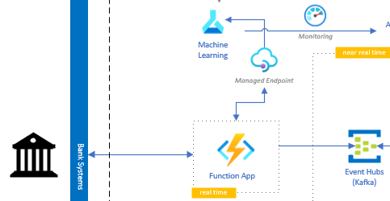
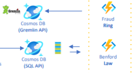
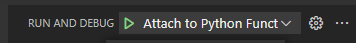
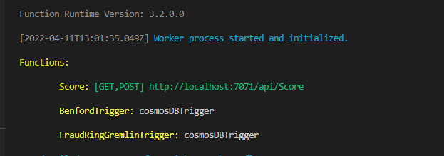
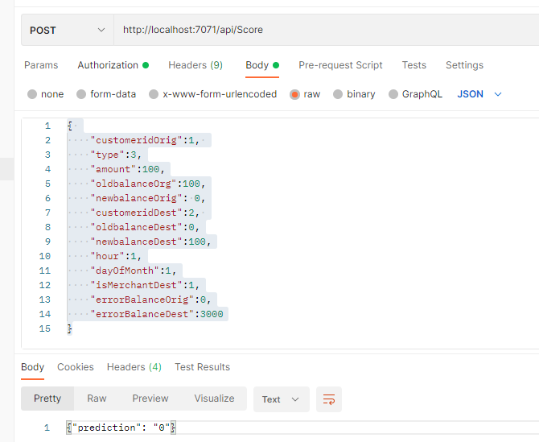
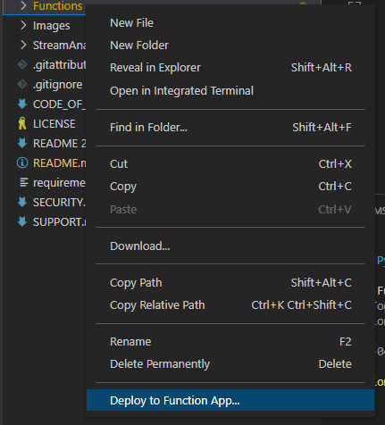

# Deploy the Functions
With all configured services, we can now deploy the functions. We have three functions: Orchestrator, Benford Law and Fraud Ring.

## Definitions

- Orchestrator Function: This HTTP trigger function has two responsabilities: First, it needs to respond if the transaction is a potential Fraud or not. To do that, it is necessary to call other APIs. In a first version, only a Supervised ML Model will be requested and will return the prediction (Fraud or Non-Fraud) given a Transaction payload. Other three scores should compose this prediction (Graph DB, Benford Law and Profile Analytics). These scores are under development. The second responsability of this function is to post an event in the Event Hubs with the transaction payload and the returned prediction. This event will trigger a series of other tasks (Create the vertices and edges on graph db, calculate benford law, feed the dashboards, etc.).



- Benford Law Function: This is a CosmosDB Trigger function, for each new document added to Transactions DB on Cosmos SQL API this trigger will calculate the [Benford Law](https://en.wikipedia.org/wiki/Benford%27s_law) distributions for first and second digits.

- Fraud Ring Function: This is a CosmosDB Trigger function, for each new document added to Transactions DB on Cosmos SQL API this trigger will feed a graph database using CosmosDB Gremlin API. This database will contain vertices and edges representing the relationships between customers. For example, if a Customer A makes a deposit to a Customer B, this relationship will be represented in this graph db with two vertices (Customers A and B) and a edge (the deposit transaction between them). There will be a property in this edge to flag if this transaction is a fraud or not according to the prediction. With these data it could be calculated a fraud ring.



## Deploy the Functions

Now we can deploy the functions. For this, we have in this [folder](/Functions/) all functions ready to be deployed. You can try them in your local environment. We encorage you to use VS Code as the IDE because there are a lot of good features to run the Functions. It's nice to install [Azure Functions extension](https://docs.microsoft.com/en-us/azure/azure-functions/functions-develop-vs-code?tabs=python).

### Configure Local.settings.json
You will need to configure the `local.settings.json` file with your Azures' environment. We have a example of this file [here](/Functions/local.settings.json.example). Please change with your own configs and rename it to **local.settings.json**.

### Try it locally
In VS Code, open [Score Function](/Functions/Score/__init__.py) and press F5. Don't forget to select *Attach to Python Functions* in Debug options:



Check if the services are running locally:



You can try making a request to `http://localhost:7071/api/Score` using a API tool (Postman, etc.) using the following payload:

```json
{ 
    "customeridOrig":1, 
    "type":3,
    "amount":100,
    "oldbalanceOrg":100,
    "newbalanceOrig": 0,
    "customeridDest":2, 
    "oldbalanceDest":0,
    "newbalanceDest":100,
    "hour":1,
    "dayOfMonth":1,
    "isMerchantDest":1,
    "errorBalanceOrig":0,
    "errorBalanceDest":3000
}
```

You should see this return:



### Deploy to Azure

We need a Function App on Azure to be able to deploy the Functions. If you use the *Deploy to Azure* button to create the Azures' services you should already have this Function App within the Resource Group.

With the Azure Functions VS Code extension we can deploy them directly from the IDE. Right click on [Functions](/Functions/) folder and select **Deploy to Function App...**:




