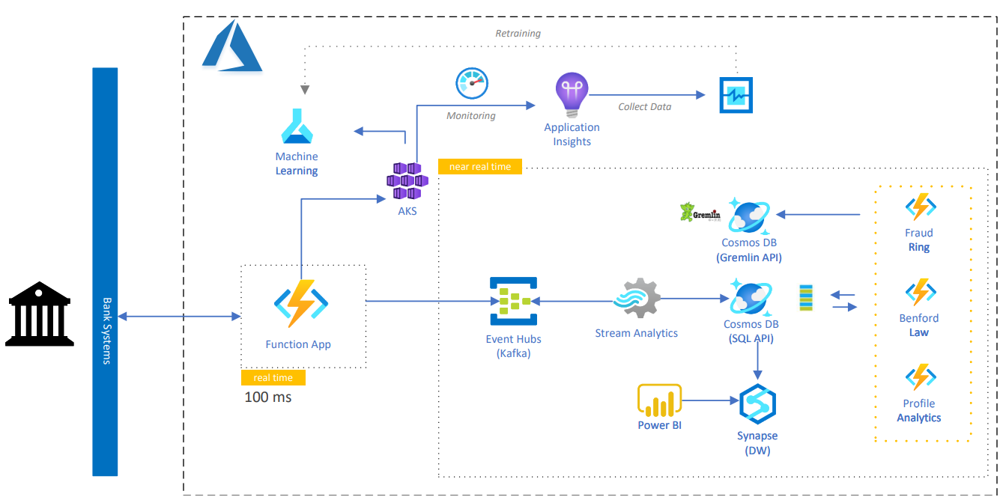

# Real-Time Fraud Detection on Azure

<!-- 
Guidelines on README format: https://review.docs.microsoft.com/help/onboard/admin/samples/concepts/readme-template?branch=master

Guidance on onboarding samples to docs.microsoft.com/samples: https://review.docs.microsoft.com/help/onboard/admin/samples/process/onboarding?branch=master

Taxonomies for products and languages: https://review.docs.microsoft.com/new-hope/information-architecture/metadata/taxonomies?branch=master
-->

The detection of possible fraud in financial systems has been one of the significant challenges of several organizations worldwide. In this sense, enabling the development of robust solutions that allow real-time actions is increasingly important for companies that seek to ensure greater security for their customers in carrying out financial transactions.

This repository presents a reference architecture that allows the development of Machine Learning models to be integrated into a real-time fraud detection platform.

In addition, the architecture also allows a series of asynchronous processes to be triggered near-real-time, aiming to feed monitoring dashboards and execute data enrichment routines that can support the fraud detection process.

We demonstrate routines that perform the calculation of [Benford's Law](https://en.wikipedia.org/wiki/Benford's_law) and the construction of graphs to identify Fraud Rings to enable advances in fraud prevention.

For this, several Azure resources are used. Below the Reference Architecture:

Please check the prerequisites and step-by-step instructions for configuring the resources used in the items below.

## Prerequisites

To use this repository, you need access to an [Azure subscription](https://azure.microsoft.com/free/). Below we will show the steps to deploy and configure the services.

While it's not required, a basic understanding of some services used will be helpful for understanding the solution. The following resources can help introduce you to them:

1. [Azure Machine Learning Overview](https://azure.microsoft.com/services/machine-learning/)
2. [Azure Functions](https://docs.microsoft.com/en-us/azure/azure-functions/functions-overview)
3. [Azure Event Hub](https://docs.microsoft.com/en-us/azure/event-hubs/)
4. [Azure Stream Analytics](https://docs.microsoft.com/en-us/azure/stream-analytics/stream-analytics-introduction)
5. [Azure Synapse](https://docs.microsoft.com/en-us/azure/synapse-analytics/overview-what-is)
6. [Azure Cosmos DB](https://docs.microsoft.com/en-us/azure/cosmos-db/)

# Getting started

### 1. Deploy Resources

Start by deploying the resources to Azure. The button below will deploy All the services and its related resources:

### 2. Configure Azure ML Environment

Next you'll need to configure your [development environment](https://docs.microsoft.com/azure/machine-learning/how-to-configure-environment) for Azure Machine Learning. We recommend using an [Azure ML Workspace](https://docs.microsoft.com/en-us/azure/machine-learning/quickstart-create-resources) as it's the fastest way to get up and running. 

Now you can use the AML environment. Let's train and deploy the Machine Learning model.

[Train and Deploy the model](./AzureMachineLearning/README.md)

### 3. Configure Stream Analytics
We will configure a Stream Analytics Job to consume the inputs from Event Hub and persist the outputs to an Azure Synapse SQL Pool and to a Cosmos DB SQL API. In this way we can use the outputs to feed some other processes.

[Configure Stream Analytics Job](./StreamAnalytics/README.md)

### 4. Configure Cosmos DB
We need to load some data to our Cosmos DB SQL API account. The link below provide a process to do that.

[Configure Cosmos DB - SQL API](./AzureCosmosDB/README.md)

### 5. Deploy the Functions
Finally, we have to deploy the Functions. Follow the link below to proceed with this task.
[How to Deploy the Functions](./Functions/README.md)

## To Do
1. Develop Profile Analytics Function
2. Calculate scores from Graph db, Benford Law, and Profile Analytics
3. Integrate scores into Orquestrator function
4. Develop new supervised ML models

## Contributing

This project welcomes contributions and suggestions.  Most contributions require you to agree to a
Contributor License Agreement (CLA) declaring that you have the right to, and actually do, grant us
the rights to use your contribution. For details, visit https://cla.opensource.microsoft.com.

When you submit a pull request, a CLA bot will automatically determine whether you need to provide
a CLA and decorate the PR appropriately (e.g., status check, comment). Simply follow the instructions
provided by the bot. You will only need to do this once across all repos using our CLA.

This project has adopted the [Microsoft Open Source Code of Conduct](https://opensource.microsoft.com/codeofconduct/).
For more information see the [Code of Conduct FAQ](https://opensource.microsoft.com/codeofconduct/faq/) or
contact [opencode@microsoft.com](mailto:opencode@microsoft.com) with any additional questions or comments.

## Trademarks

This project may contain trademarks or logos for projects, products, or services. Authorized use of Microsoft 
trademarks or logos is subject to and must follow 
[Microsoft's Trademark & Brand Guidelines](https://www.microsoft.com/en-us/legal/intellectualproperty/trademarks/usage/general).
Use of Microsoft trademarks or logos in modified versions of this project must not cause confusion or imply Microsoft sponsorship.
Any use of third-party trademarks or logos are subject to those third-party's policies.