# Configure Stream Analytics

In this Section you will configure the Azure Stream Analytics (ASA) service. ASA will be responsible to consume the messages posted in the Event Hub by the Real-Time Function and deliver some outputs to Cosmos DB SQL API and to Azure Synapse SQL Pool. . For more informations about ASA, please check the [Stream Analytics Documentation](https://docs.microsoft.com/en-us/azure/stream-analytics/stream-analytics-introduction).

## Prerequisites

You should have the following Services configured:

- Azure Stream Analytics
- Azure Event Hubs
- Azure Cosmos DB SQL API
- Azure Synapse Dedicated SQL Pool

All these services are deployed using the **Deploy to Azure** button ([see the main Section](./README.md)).

## Quick Start

### Add Input

Open your Stream Analytics Service and go to **Inputs** under *Job topology* menu:

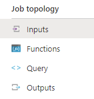

Click on **+ Add stream input** and select **Event Hub**. The following screen should appear:

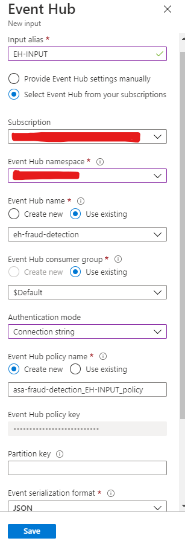

Select the existing Event Hub created to the Fraud Architecture. You can leave all the other default configs.

You can use the same Event Hub already deployed, so select in **Event Hub namespace** the same Event Hub already created. You can do the same for **Event Hub name** and use the existing one. For the **consumer group** select **Use Existing** and select **$Default**. Change the **Authentication mode** to **Connection string** and if you want provide another name to the *policy name*. Don't forget to provide an **Input Alias** as well.

Now you can click on **Save** to add the Event Hub as an Input.

### Add the Outputs

We will add two outputs: Azure Synapse Dedicated Poll and Cosmos DB SQL API.

#### Azure Synapse

First, open Azure Synapse Studio (click on your Synapse Workspace):

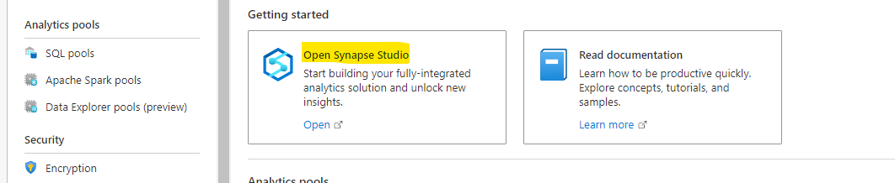

In your Synapse Studio, let's create a new [Dedicated SQL Pool](https://docs.microsoft.com/en-us/azure/synapse-analytics/sql-data-warehouse/sql-data-warehouse-overview-what-is) to persist the table we'll use.

Click on Manage > SQL Pools > New:

Next let's create a table into the new Database. For this click on **Data** and Open the DB.

Click on Tables > New SQL script -> New Table:

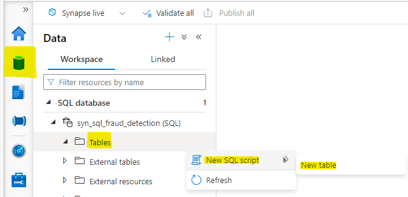

Let's use a ready script for our table. You can copy the script from [this folder](./Tables/TB-EVENTS-FRAUD-DETECTION.sql) and paste into the SQL Script Editor:

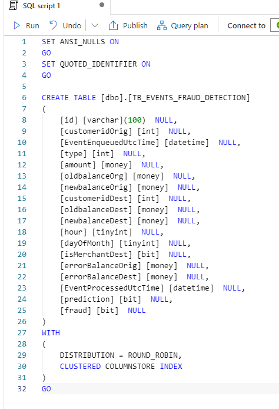

Next click on **Run** and the table will be created.

This **TB_EVENTS_FRAUD_DETECTION** table will be used in Stream Analytics to persist the streaming data into Azure Synapse SQL Pool. It can be used to create Dashboards, join with other data, etc.

Now let's add the Synapse Output in our Stream Analytics service.

Open your Stream Analytics Service and go to **Outputs** under *Job topology* menu:

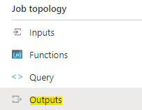

Click on +Add > Azure Synapse Analytics (notice there a lot of other options of data sources).

Configure all the settings following the below image:

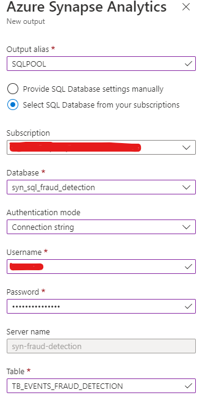

Put your own credentials of Azure Synapse and click on **Save**. The process will test your connection. Check if it the Connection to SQL Pool output succeeded.

#### Cosmos DB SQL API

For the Cosmos DB we will also persist the streaming transactions so we can use them in others processess (create the Fraud Ring, Calculate the Benford's Law, etc). 

For this, open your Cosmos DB SQL API account. Click on Data Explorer. You should see a database named **fraud-detection-sql-db**.

In this db click on New Container. Create a new container named as **Transactions** (put the /id field as partition key):

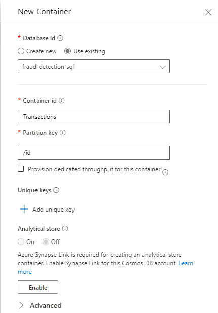

Click on OK to create the container. It will be also used to persist the Streaming Data from Stream Analytics, however for different purposes.

Now come back to your Stream Analytics Service and go to **Outputs**. 

Click on +Add > Cosmos DB.

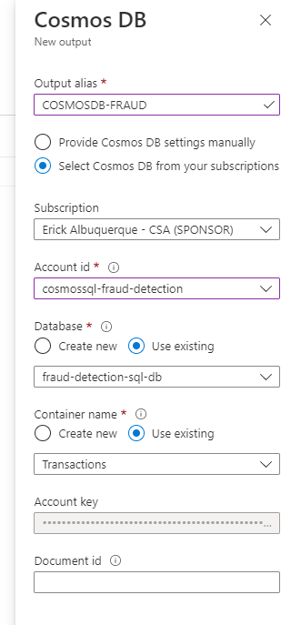

Click on **Save** and check if the Connection to Cosmos DB output succeeded.

### Add the Query
With the inputs and outputs configured we can add the query. You can use this [Query](./query.sql) as template.

Click on Query under *Job topology* menu and add the [Query Content](./query.sql)

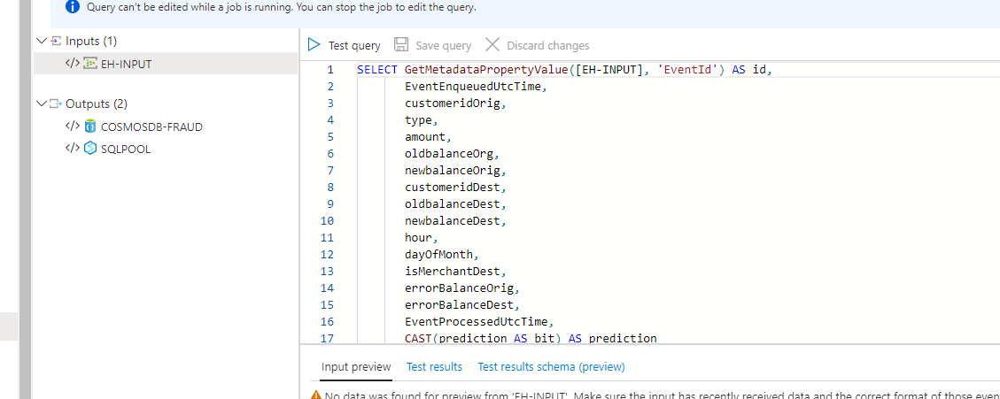

Click on **Save query**.

### Start your Stream Analytics job

now start the Stream Analytics Job. Go to the overview page and click on **Start**

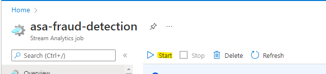
